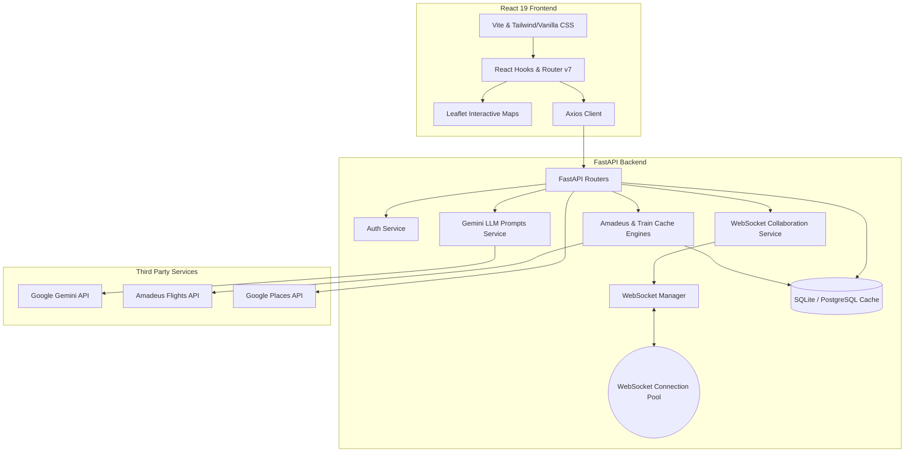

# 🧭 AI-Powered Travel Agent & Collaborative Planner

An advanced, full-stack travel scheduling and real-time collaboration platform. The application combines the power of generative large language models (Google Gemini) with real-world travel APIs (Amadeus, Google Places, IRCTC) to deliver robust travel itineraries, interactive mapping, live streaming chatbot assistants, and real-time multiplayer trip planning workspaces.

Designed to meet production-grade specifications, this project showcases clean architecture, relational database caching, reactive WebSocket state management, and reliable API fallbacks.

---

## 🏗️ Architecture Overview

The application is engineered as a decoupled, multi-tier system:



---

## ✨ Key Implemented Features

### 1. Real-Time Collaborative Workspace
*   **WebSockets Multiplayer Sync:** A dedicated WebSocket coordinator allows multiple users to view, edit, and plan itineraries concurrently.
*   **Role-Based Access Control:** Invite-only workspaces distinguish between trip **Owners** (write/edit permissions) and **Collaborators** (view-only capabilities).
*   **Secure SMTP OTP Invites:** SMTP service sends secure invitation links with 6-digit verification codes to protect collaboration sessions.

### 2. Generative AI Itinerary Builder
*   **Structured Output Engine:** Custom, strict system prompting forces Gemini to generate structured JSON plans directly, bypassing brittle regex sanitization.
*   **Day-by-Day Meal & Hotel Recommendations:** Rather than hardcoding single hotels or eateries, the engine provides **3 to 4 distinct options** categorized by budget (e.g., Luxury vs. Budget) to enhance customer decision-making.
*   **Time-Based Bullet Layout:** Every scheduled plan operates on a strict timeline using standard "•" bullets for cohesive rendering in the React UI.

### 3. Smart Conversational Assistant ("Myra")
*   **Intelligent Intent Parser:** Detects whether the user is casually chatting, requesting a structured itinerary, seeking local info, or in an emergency situation.
*   **Server-Sent Events (SSE) Streaming:** Generates responses dynamically using Server-Sent Events, matching the smooth, word-by-word streaming experience of premium chatbots.
*   **Incident Recovery Mode:** Re-routes itineraries instantly during physical travel emergencies. If coordinate markers detect a travel incident, it fetches the closest hospital and designs a low-stress rest schedule.

### 4. Advanced Multi-Modal Transit Caching
*   **Flight API Caching:** Queries database caches first to minimize rate-limiting costs on the Amadeus API, with intelligent fallback to random realistic flight tables.
*   **Train Stop Sequence Router:** Allows users to query complex train routes mapping intermediate stop sequences, operating days, and speed configurations. Includes station autocomplete suggestions.

### 5. Proximity Maps & Community Loops
*   **Interactive Leaflet Maps:** Integrates custom mapping scripts showing flight/train transit overlays and hotels locations.
*   **Google Places Streamer:** Fetches, caches, and streams place images using Google Places photo reference keys directly to the browser.
*   **Personalized Recommendation Feed:** Uses search histories to build personalized travel feeds. Includes community-based review cards for crowdsourced place recommendations.

---

## 🛠️ Technology Stack

### Backend
*   **Framework:** FastAPI (Asynchronous Python ASGI framework)
*   **ORM:** SQLAlchemy (relational mapping and session transaction handling)
*   **Migrations:** Alembic (database migration scripts)
*   **Communication:** WebSockets (collaborative channels) and SSE (chatbot streaming)
*   **Database:** SQLite (local development) / PostgreSQL (production Render DB)
*   **AI SDK:** `google-generativeai` (Gemini API)

### Frontend
*   **Core:** React 19 (highly optimized Hooks) & Vite (extremely fast development bundles)
*   **Navigation:** React Router v7
*   **Mapping:** Leaflet & React-Leaflet
*   **Networking:** Axios (with request/response interceptors to secure token handshakes)

---

## 📂 Restructured Directory Layout

```
├── backend/
│   ├── app/
│   │   ├── models/                # SQLAlchemy database schema models
│   │   ├── routers/               # Modular APIRouters (Auth, Collaboration, Flights, Places, Itinerary, Reviews)
│   │   ├── services/              # API connections (Amadeus, Gemini, Google Maps, SMTP Mail)
│   │   ├── utils/                 # Development scripts (train data parsers, mock helpers)
│   │   ├── database.py            # SQLite/PostgreSQL DB engines and dependencies
│   │   ├── websocket_manager.py   # WebSocket connection pools
│   │   └── __init__.py
│   ├── alembic/                   # Database versioning histories
│   ├── data/                      # Raw transit station JSON assets
│   ├── main.py                    # Minimal application entry point and startup configurations
│   ├── Requirements.txt           # Python application dependencies
│   └── .env.example               # Secure environment variables template
├── frontend/
│   ├── src/                       # React modules (Components, Pages, Hooks)
│   ├── public/                    # Static UI layouts
│   ├── index.html                 # HTML entry frame
│   ├── package.json               # Node dependencies
│   └── vite.config.js             # Vite build configs
├── docs/
│   └── interview_prep/            # Relocated study guides
├── .gitignore                     # Clean global version control filters
└── README.md                      # Project developer documentation
```

---

## 🚀 Local Setup Guide

### 1. Backend Setup

Navigate into the backend folder:
```bash
cd backend
```

Create a virtual environment and activate it:
```bash
# Windows
python -m venv .venv
.venv\Scripts\activate

# macOS/Linux
python3 -m venv .venv
source .venv/bin/activate
```

Install all dependencies:
```bash
pip install -r requirements.txt
```

Set up configurations:
1. Copy `.env.example` to `.env`
2. Configure your keys inside `.env` (`GEMINI_API_KEY`, `GOOGLE_API_KEY`, etc.)

Run database setup (creates the database tables and runs initial train schedules parsing):
```bash
python migrate_reviews.py
```

Boot the server:
```bash
uvicorn main:app --reload
```
The API is now running locally at `http://127.0.0.1:8000`. You can inspect the interactive OpenAPI specifications at `http://127.0.0.1:8000/docs`.

---

### 2. Frontend Setup

Navigate into the frontend folder:
```bash
cd ../frontend
```

Install packages:
```bash
npm install
```

Start the Vite development server:
```bash
npm run dev
```
The client dashboard is now live at `http://localhost:5173`. Enjoy planning your trip!
